# Software Design Document — FoodResQ

**Capstone Project — SP26SE088 — FPT University**
**Food Rescue & Surplus-Food Sharing Platform**

> How to use this document: Each ` ```plantuml ``` ` block is a diagram — render it at [plantuml.com](https://www.plantuml.com/plantuml) or a PlantUML extension, then paste the image into Word/Docs. The detailed sequence diagrams for each feature are kept separately in [`sequence-diagrams.puml`](sequence-diagrams.puml).

---

## I. Record of Changes

| Date | A*M, D | In charge | Change Description |
|---|---|---|---|
| 19/11/2025 | A | Le Duc Tri | Initialized the document; added 1.1 System Architecture + Architecture Diagram |
| 22/11/2025 | A | Le Duc Tri | Added 1.1.2 Component Explanation |
| 25/11/2025 | A | Le Duc Tri | Added 1.2 Package Diagram (Backend + Frontend) |
| 02/12/2025 | A | Le Duc Tri | Added section 2. Database Design + table descriptions |
| 10/12/2025 | A | Le Duc Tri | Added 3. Detailed Design (Auth, Listing, Reservation) |
| 20/12/2025 | A | Le Duc Tri | Added Detailed Design for Delivery, Campaign, Kitchen Ops, Recipe |
| 28/06/2026 | M | Le Duc Tri | Updated to match the latest source code (PrismaService, PostGIS, FCM) |

> *A – Added, M – Modified, D – Deleted*

---

## II. Software Design Document

### 1. System Design

#### 1.1 System Architecture

FoodResQ is a multi-platform system following a **layered client–server architecture** with a single, centralized backend API. All business logic and data access are encapsulated in the API tier (NestJS); the clients (Next.js Web, Expo Mobile) communicate only through REST API (HTTPS) and WebSocket (Socket.IO) and never access the database directly.

The system integrates several backing services: **PostgreSQL + PostGIS** (storage of geospatial data), **Redis** (Redlock distributed locking + BullMQ queue), **Firebase** (Google authentication + FCM push notifications), and a **face-recognition service** (verifying the receiver during pickup/delivery).

##### 1.1.1 Architecture Diagram

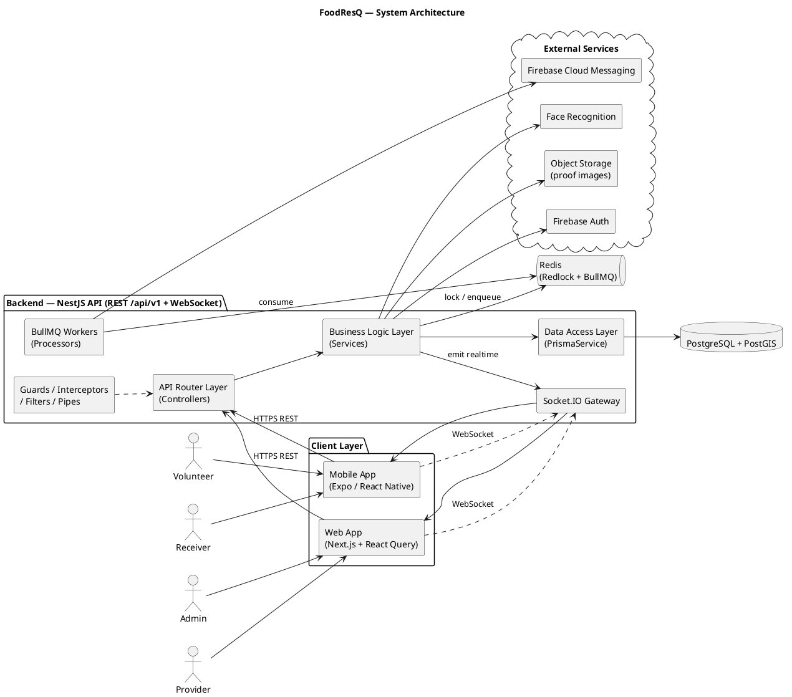

##### 1.1.2 Component Explanation

| No | Component | Technology / Pattern | Function Description |
|---|---|---|---|
| 1 | Web App | Next.js 15 (App Router), React Query, Tailwind/shadcn, Mapbox | Portal for Provider & Admin: manage listings, review verification requests, track ESG metrics, administer campaigns. Communicates with the API over HTTPS only. |
| 2 | Mobile App | Expo / React Native, React Query | App for Receiver & Volunteer: search nearby food, make reservations, scan QR, accept delivery tasks, join kitchen campaigns. |
| 3 | API Router Layer | NestJS Controllers, Swagger | Exposes REST endpoints under `/api/v1`. Routes requests, validates input (DTO + class-validator), enforces authentication/authorization, and delegates to the business layer. |
| 4 | Business Logic Layer | NestJS Services (Providers) | The core layer: business rules (daily reservation limit, trust score, shipper assignment, campaign slots…), transaction orchestration, and calls to external services. |
| 5 | Data Access Layer | Prisma ORM (`PrismaService`) | Database abstraction layer. Centralizes all ORM queries and `$queryRaw`/`$executeRaw` (PostGIS). Upper layers never access the database directly. |
| 6 | Socket.IO Gateway | `@nestjs/websockets` + Socket.IO | Real-time channel. Verifies JWT on connect, joins the client to room `user:{id}`, emits `notification:new` and `delivery:location` events. |
| 7 | BullMQ Workers | `@nestjs/bullmq` + Redis | Handles asynchronous tasks: broadcasting offers to shippers, dispatching push notifications. Queue: `notification-push`. |
| 8 | Cross-cutting | Guards, Interceptors, Filters, Pipes | `JwtAuthGuard`, `RolesGuard`, ValidationPipe (whitelist + transform), exception filter that normalizes `{ success, error }`, response transform `{ success, data, meta }`. |
| 9 | PostgreSQL + PostGIS | PostgreSQL 16, PostGIS extension | Primary data store. `geography(Point,4326)` columns for locations, `ST_DWithin`/`ST_Distance` queries, GiST indexes. All reads/writes go through NestJS so business rules are enforced. |
| 10 | Redis | Redis + Redlock + BullMQ | Distributed lock to prevent double-booking (`lock:reservation:{id}`), job queue, and system-config caching. |
| 11 | Firebase Auth | firebase-admin | Google sign-in (verify ID token), auto-creates a receiver account when the email is already verified. |
| 12 | Firebase Cloud Messaging | firebase-admin (messaging) | Sends multi-device push notifications; prunes dead tokens automatically. |
| 13 | Face Recognition | FaceMatchService | Extracts and compares face vectors when a receiver verifies a pickup. |
| 14 | Object Storage | StorageService | Stores proof images (pickup proof, campaign images, food-safety photos, distribution photos). |

---

#### 1.2 Package Diagram

##### 1.2.1 Backend (NestJS)

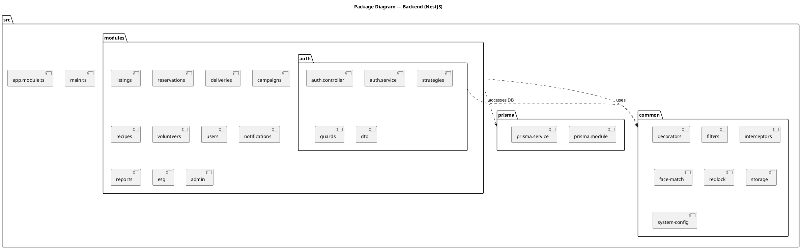

**Package Description — Backend**

| No | Package | Description |
|---|---|---|
| 1 | `src` | Root directory containing all backend source code |
| 2 | `main.ts` | Entry point: enables Helmet, CORS, global ValidationPipe, Swagger |
| 3 | `app.module.ts` | Root module; imports all feature modules + ConfigModule + BullMQ |
| 4 | `modules/auth` | Register, login, Google login, refresh/logout, JWT strategy, guards |
| 5 | `modules/listings` | Food listing management, location-based search (PostGIS) |
| 6 | `modules/reservations` | Reservation, QR scan, face verification, cancellation, rating, trust score |
| 7 | `modules/deliveries` | Shipper assignment (broadcast/accept/reject), delivery tracking |
| 8 | `modules/campaigns` | Charity kitchen campaigns, applications, donations, change requests, kitchen-ops |
| 9 | `modules/recipes` | Recipe library + ingredients (chef contributions) |
| 10 | `modules/volunteers` | Volunteer profiles, availability toggle, real-time location update |
| 11 | `modules/users` | User profiles, profile updates |
| 12 | `modules/notifications` | Unified notifications (DB + WebSocket + FCM), device tokens |
| 13 | `modules/reports` | Reporting of users/listings/campaigns |
| 14 | `modules/esg` | ESG statistics (food rescued, CO₂ saved) |
| 15 | `modules/admin` | Verification review, administration, audit |
| 16 | `common/decorators` | `@CurrentUser()`, `@Roles()` |
| 17 | `common/guards` | `JwtAuthGuard`, `RolesGuard` |
| 18 | `common/filters` | Exception filter that normalizes error responses |
| 19 | `common/interceptors` | Logging, response transform `{ success, data, meta }` |
| 20 | `common/face-match` | Face extraction & matching service |
| 21 | `common/redlock` | Redis distributed lock |
| 22 | `common/storage` | Proof-image storage |
| 23 | `common/system-config` | Reads dynamic config (reservation limit, trust-score thresholds…) |
| 24 | `prisma` | `PrismaService` — the single data-access layer |

##### 1.2.2 Frontend (Web — Next.js)

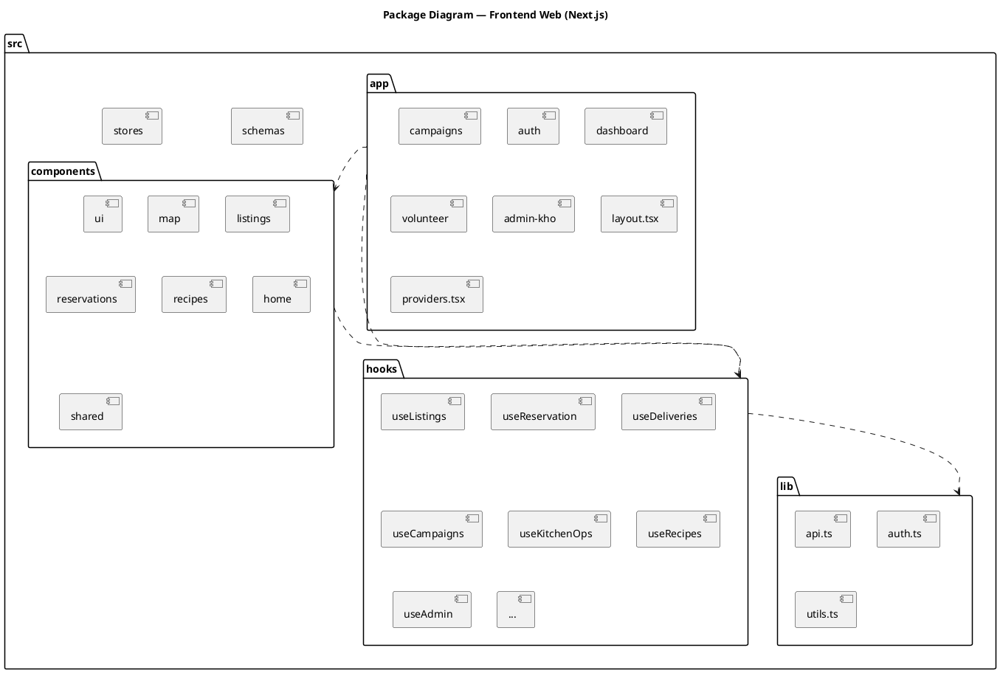

**Package Description — Frontend Web**

| No | Package | Description |
|---|---|---|
| 1 | `app/(auth)` | Login / register pages |
| 2 | `app/(dashboard)` | Admin/management area: listings, reservations, deliveries, provider, admin, history, profile |
| 3 | `app/campaigns` | Kitchen campaign pages |
| 4 | `app/volunteer` | Volunteer area |
| 5 | `app/admin-kho` | Warehouse/operations administration |
| 6 | `app/providers.tsx` | Initializes React Query Provider and theme |
| 7 | `components/ui` | Reusable shadcn/ui components |
| 8 | `components/map` | Mapbox map, `LocationPicker` |
| 9 | `components/listings` | `ListingCard` and listing UI |
| 10 | `components/reservations` | Reservation UI, QR display |
| 11 | `components/recipes` | Recipe UI |
| 12 | `hooks` | React Query hooks (useListings, useReservation…) that call the API |
| 13 | `lib/api.ts` | Axios instance + interceptor for automatic JWT refresh |
| 14 | `lib/auth.ts` | Authentication configuration |
| 15 | `schemas` | Zod schemas mirroring backend DTOs |
| 16 | `stores` | Zustand stores (client state) |

##### 1.2.3 Frontend (Mobile — Expo)

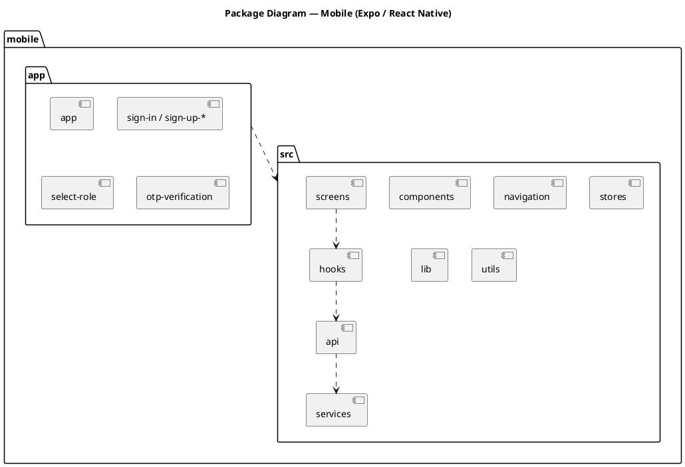

**Package Description — Mobile**

| No | Package | Description |
|---|---|---|
| 1 | `app/` | Expo Router: sign-in/sign-up screens, role selection, OTP/phone verification |
| 2 | `src/screens` | Main screens per role (Receiver / Volunteer) |
| 3 | `src/components` | Reusable UI components |
| 4 | `src/navigation` | Navigation configuration |
| 5 | `src/hooks` | React Query hooks |
| 6 | `src/api` | REST API call layer |
| 7 | `src/services` | Services (FCM, location, local storage) |
| 8 | `src/stores` | Global state |
| 9 | `src/lib` / `src/utils` | Shared utilities |

---

### 2. Database Design

The PostgreSQL database (with the PostGIS extension) consists of 32 tables grouped by business domain. Primary keys use UUIDs (`uuid_generate_v4()`); location columns use the `geography(Point,4326)` type with GiST indexes; soft deletes use `deleted_at`.

> **Deployment note:** All 32 tables are deployed to production (Supabase). The **Kitchen / Recipe** feature set — `recipes`, `recipe_ingredients`, `campaign_menu_items`, `kitchen_safety_logs`, `meal_distributions`, `meal_feedback`, `campaign_shifts` — was added most recently.

#### 2.1 ER Overview (simplified)

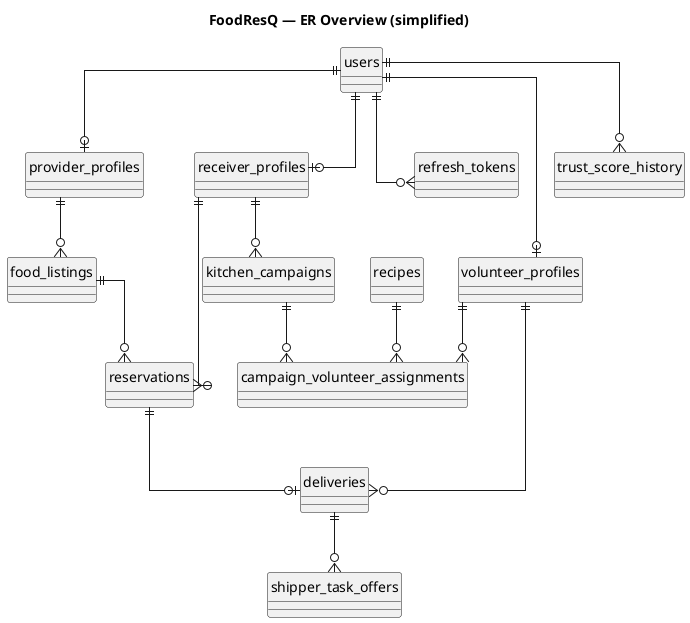

#### 2.2 Table Descriptions

##### Users & Authentication

**users** — User accounts (all roles)

| Column | Type | Description |
|---|---|---|
| id | UUID (PK) | User identifier |
| email | varchar(255) UNIQUE | Login email |
| phone | varchar(20) UNIQUE NULL | Phone number |
| password_hash | text | bcrypt-hashed password (rounds ≥ 12) |
| full_name | varchar(255) | Full name |
| avatar_url | text NULL | Avatar image |
| role | enum user_role | admin / provider / receiver / volunteer |
| status | enum user_status | pending_verification / active / suspended / banned |
| trust_score | smallint (default 100) | Trust score (0–100) |
| last_login_at | timestamptz NULL | Last login time |
| created_at / updated_at / deleted_at | timestamptz | Timestamps, soft delete |

**refresh_tokens** — Refresh tokens (hashed), rotated on each refresh

| Column | Type | Description |
|---|---|---|
| id | UUID (PK) | |
| user_id | UUID (FK→users) | Token owner |
| token_hash | text UNIQUE | Hashed token |
| device_info / ip_address | varchar | Device, IP |
| is_revoked / revoked_at | bool / timestamptz | Revocation state |
| expires_at | timestamptz | Expiry (30 days) |

**liability_waivers** — Liability waivers the user has accepted.

##### Role Profiles

**provider_profiles** — Provider profiles

| Column | Type | Description |
|---|---|---|
| id | UUID (PK) | |
| user_id | UUID UNIQUE (FK→users) | |
| business_name | varchar(255) | Business name |
| business_type | enum business_type | restaurant / supermarket / bakery / hotel / other |
| tax_code | varchar(50) NULL | Tax code |
| address | text | Address |
| location | geography(Point,4326) | Location (GiST index) |
| is_verified / verification_status | bool / enum | Verification state |
| total_food_rescued_kg / total_co2_saved_kg | decimal | Accumulated ESG metrics |
| avg_rating | decimal(3,2) | Average rating |

**receiver_profiles** — Receiver profiles (including charity organizations)

| Column | Type | Description |
|---|---|---|
| id | UUID (PK) | |
| user_id | UUID UNIQUE (FK→users) | |
| is_charity_org / organization_name | bool / varchar | Charity-org flag |
| id_card_number / id_card_image_url | varchar / url | ID card |
| face_image_url / face_descriptor | url / json | Enrolled face data |
| location | geography(Point,4326) | Location |
| reservations_today | smallint | Daily reservation count (limit) |
| verification_status | enum | Verification state |

**volunteer_profiles** — Volunteer profiles

| Column | Type | Description |
|---|---|---|
| id | UUID (PK) | |
| user_id | UUID UNIQUE (FK→users) | |
| current_location / location_updated_at | geography / timestamptz | Real-time location (GiST) |
| is_available | bool | Currently available for tasks |
| dedication_points | int | Dedication points |
| rank | enum volunteer_rank | newcomer / active / experienced / expert |
| vehicle_type / vehicle_plate | varchar | Vehicle |
| verification_status | enum | Verification state |

**volunteer_specializations** — Volunteer skills (shipper / chef / waiter), with food-safety certificate and `is_verified` flag. UNIQUE(volunteer_id, specialization).

##### Food & Reservations

**food_listings** — Food listings

| Column | Type | Description |
|---|---|---|
| id | UUID (PK) | |
| provider_id | UUID (FK→provider_profiles) | |
| title / description | varchar / text | |
| category | enum food_category | cooked_meal, bakery, vegetables… |
| quantity_total / quantity_remaining | decimal | Quantity (decremented on reservation) |
| quantity_unit | enum | kg / portion / item / box / liter |
| pickup_start_time / pickup_end_time / expiry_time | timestamptz | Pickup window, expiry |
| pickup_address / pickup_location | text / geography | Pickup point (GiST index) |
| max_per_reservation | smallint | Limit per reservation |
| is_surprise_bag | bool | Surprise bag (hides contents) |
| status | enum listing_status | draft / active / fully_reserved / completed / expired / cancelled |
| deleted_at | timestamptz | Soft delete |

**reservations** — Reservations

| Column | Type | Description |
|---|---|---|
| id | UUID (PK) | |
| listing_id / receiver_id | UUID (FK) | Listing & receiver |
| quantity | decimal | Reserved quantity |
| status | enum reservation_status | confirmed / picked_up / completed / cancelled / expired / no_show |
| qr_token | varchar(64) UNIQUE | QR code (gen_random_bytes) |
| qr_expires_at | timestamptz | QR expiry (default +30m) |
| pickup_proof_url / pickup_proof_at / pickup_verification_type | url / ts / enum | Pickup proof (face / id_card) |
| scanned_by / scanned_at | UUID / ts | Who scanned the QR |
| cancelled_at / cancellation_reason | ts / text | Cancellation info |

##### Delivery

**deliveries** — Delivery orders

| Column | Type | Description |
|---|---|---|
| id | UUID (PK) | |
| reservation_id | UUID UNIQUE (FK) | Linked reservation |
| shipper_id | UUID NULL (FK→volunteer_profiles) | Assigned shipper |
| status | enum delivery_status | pending_assignment → assigned → heading_to_provider → qc_completed → in_transit → delivered / failed |
| pickup_location / delivery_location | geography | Pickup & drop-off points |
| distance_km | decimal | Distance (ST_Distance) |
| assigned_at / picked_up_at / delivered_at | timestamptz | Status timestamps |

**shipper_task_offers** — Offers sent to the nearest available shippers

| Column | Type | Description |
|---|---|---|
| id | UUID (PK) | |
| delivery_id / shipper_id | UUID (FK) | UNIQUE(delivery_id, shipper_id) |
| status | enum offer_status | pending / accepted / rejected / expired |
| offered_at / responded_at / expires_at | timestamptz | Expires after 2 minutes |

##### Charity Kitchen (Kitchen Campaign)

**kitchen_campaigns** — Kitchen campaigns

| Column | Type | Description |
|---|---|---|
| id | UUID (PK) | |
| charity_receiver_id | UUID (FK→receiver_profiles) | Charity organization owner |
| title / description / kitchen_address | varchar / text | |
| kitchen_location | geography(Point,4326) | Kitchen location (GiST) |
| scheduled_date / start_time / end_time | date / varchar | Schedule |
| chef/waiter/shipper_slots_needed & _filled | smallint | Slots needed & filled per role |
| status | enum campaign_status | draft / open / in_progress / completed / cancelled |
| expected_servings / actual_servings | int | Planned/actual servings |
| menu_items / schedule_items / supply_items | jsonb | Menu, schedule, supplies |

**campaign_change_requests** — Campaign change requests (awaiting admin approval); a `null` proposed column means "no change".

**campaign_donations** — Provider donations of ingredients (status: pledged → received).

**campaign_volunteer_assignments** — Volunteer assignments

| Column | Type | Description |
|---|---|---|
| id | UUID (PK) | |
| campaign_id / volunteer_id / shift_id | UUID (FK) | UNIQUE(campaign_id, volunteer_id, role) |
| role | enum assignment_role | chef / waiter / shipper |
| status | enum assignment_status | assigned → checked_in → in_progress → completed / absent / cancelled |
| check_in_time / check_out_time | timestamptz | |
| ingredient/cooked/distribution_proof_url & _at | url / ts | Proof images per step |
| points_awarded | smallint | Dedication points awarded |

**campaign_shifts** — Splits a campaign into time shifts (volunteers apply per shift).

##### Kitchen — Operations & Recipes

**recipes** / **recipe_ingredients** — Recipe library (chef contributions) and ingredients; `times_used`, `is_public`, soft delete.

**campaign_menu_items** — Campaign menu, linked to a recipe (or a free-form item).

**kitchen_safety_logs** — HACCP-lite food-safety log

| Column | Type | Description |
|---|---|---|
| id | UUID (PK) | |
| campaign_id / checked_by_volunteer_id | UUID (FK) | Campaign & checking chef |
| check_type | enum safety_check_type | temperature / hygiene / storage / cross_contamination / handwashing / other |
| measured_value | varchar(50) | Measured value ("4°C", "75°C") |
| result | enum safety_check_result | pass / warning / fail |
| photo_url / checked_at | url / timestamptz | |

**meal_distributions** / **meal_feedback** — Per-round meal distribution logs (waiter) + beneficiary feedback (1–5 stars).

##### Trust, Gamification & System

| Table | Description |
|---|---|
| **trust_score_history** | History of trust-score changes (delta, reason, score_before/after) |
| **dedication_points_history** | History of volunteers' dedication points |
| **ratings** | Polymorphic ratings (reservation/campaign), UNIQUE by (referenceType, referenceId, rater, ratee) |
| **verification_requests** | Verification requests (provider/charity/chef cert/income proof) |
| **reports** | Reports (user/listing/delivery/campaign) |
| **notifications** | In-app notifications |
| **device_tokens** | FCM tokens per device |
| **esg_snapshots** | Daily ESG metric snapshots |
| **audit_logs** | Action log (actor, action, target) |
| **system_configs** | Dynamic configuration (key–value JSON) |

---

### 3. Detailed Design

Each feature includes **(a) a Class Diagram** describing the participating classes (Controller – Service – DTO – Model) and **(b) a Sequence Diagram** describing the interaction flow. All sequence diagrams are kept in [`sequence-diagrams.puml`](sequence-diagrams.puml) — each subsection below names the corresponding diagram to insert.

> Class-diagram convention: `+` denotes a public method. Controllers call Services; Services use `PrismaService` to operate on Models. Models are Prisma entities (the DB tables in section 2).

#### 3.1 Authentication

##### 3.1.1 Class Diagram

```plantuml
@startuml class-auth
title Class Diagram — Authentication
class AuthController {
  +register(dto: RegisterDto)
  +login(dto: LoginDto)
  +google(dto: GoogleLoginDto)
  +refresh(token: string)
  +logout(user: User)
}
class AuthService {
  +register(dto): AuthResult
  +login(dto, deviceInfo, ip): AuthResult
  +loginWithGoogle(idToken, ...): AuthResult
  +refresh(rawToken, ...): AuthResult
  +logout(userId): void
  -issueTokens(user): Tokens
}
class RegisterDto {
  email; password; fullName; role
  phone?; address?; latitude?; longitude?
  businessName?; vehicleType?; volunteerRole?
}
class LoginDto { email; password }
class JwtStrategy
class JwtAuthGuard
class RolesGuard
class PrismaService
class User
class RefreshToken

AuthController --> AuthService
AuthService --> PrismaService
AuthService ..> User
AuthService ..> RefreshToken
AuthController ..> RegisterDto
AuthController ..> LoginDto
JwtAuthGuard --> JwtStrategy
@enduml
```

##### 3.1.2 Register
Sequence diagram: **`01-Auth-Register`**

##### 3.1.3 Login
Sequence diagram: **`02-Auth-Login`**

##### 3.1.4 Google Login
Sequence diagram: **`03-Auth-Google`**

##### 3.1.5 Refresh Token
Sequence diagram: **`04-Auth-Refresh`**

#### 3.2 Food Listing Management

##### 3.2.1 Class Diagram

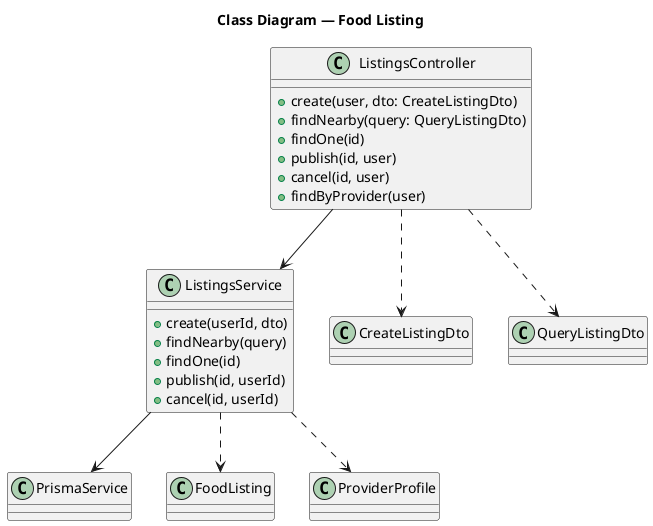

##### 3.2.2 Create Listing
Sequence diagram: **`12-Listing-Create`**

##### 3.2.3 Nearby Search (PostGIS)
Sequence diagram: **`13-Listing-NearbySearch`**

#### 3.3 Reservation

##### 3.3.1 Class Diagram

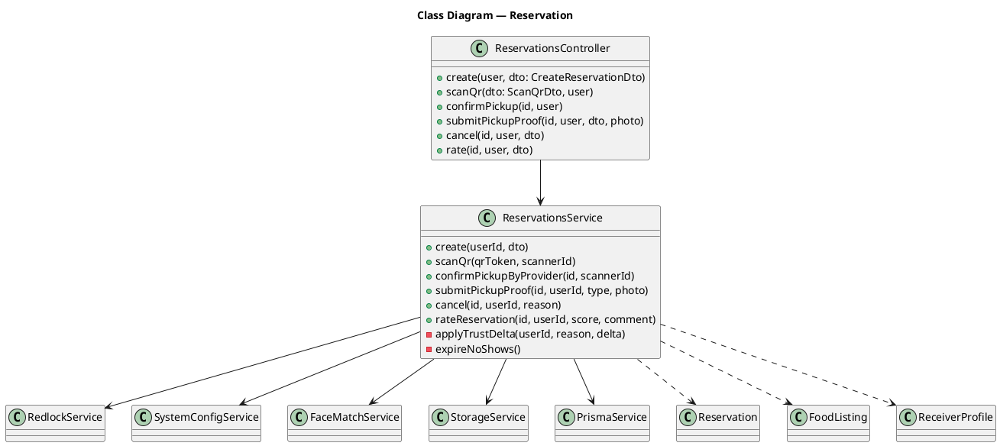

##### 3.3.2 Create Reservation (Redlock + transaction)
Sequence diagram: **`05-Reservation-Create`**

##### 3.3.3 Scan QR Pickup
Sequence diagram: **`06-Reservation-ScanQR`**

##### 3.3.4 Face Verification & Complete
Sequence diagram: **`07-Reservation-PickupProof`**

##### 3.3.5 Cancel Reservation
Sequence diagram: **`08-Reservation-Cancel`**

##### 3.3.6 Trust Score Update
Sequence diagram: **`09-TrustScore-Delta`**

#### 3.4 Delivery & Shipper Assignment

##### 3.4.1 Class Diagram

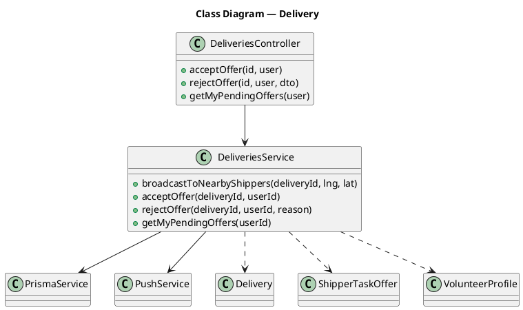

##### 3.4.2 Shipper Offer (Broadcast + Accept)
Sequence diagram: **`10-Delivery-ShipperOffer`**

#### 3.5 Volunteer

##### 3.5.1 Class Diagram

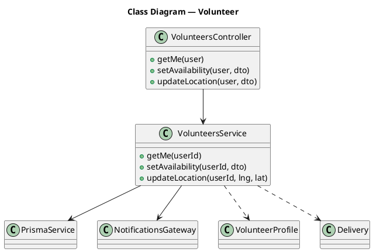

##### 3.5.2 Live Location Tracking
Sequence diagram: **`11-Volunteer-LiveLocation`**

#### 3.6 Kitchen Campaign

##### 3.6.1 Class Diagram

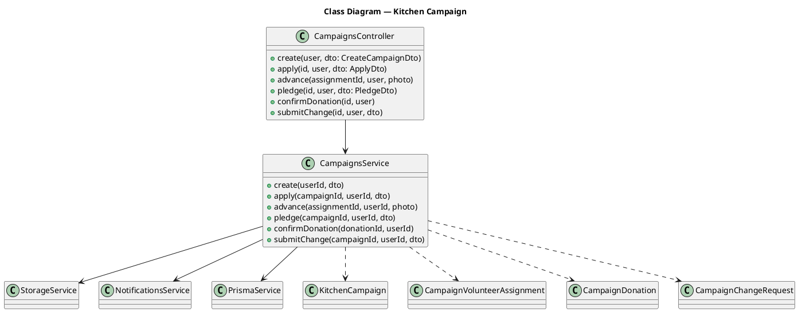

##### 3.6.2 Create Campaign
Sequence diagram: **`14-Campaign-Create`**

##### 3.6.3 Volunteer Apply
Sequence diagram: **`15-Campaign-Apply`**

##### 3.6.4 Advance Task & Points
Sequence diagram: **`16-Campaign-AdvanceTask`**

##### 3.6.5 Donation Pledge & Confirm
Sequence diagram: **`17-Campaign-Donation`**

#### 3.7 Kitchen Operations

##### 3.7.1 Class Diagram

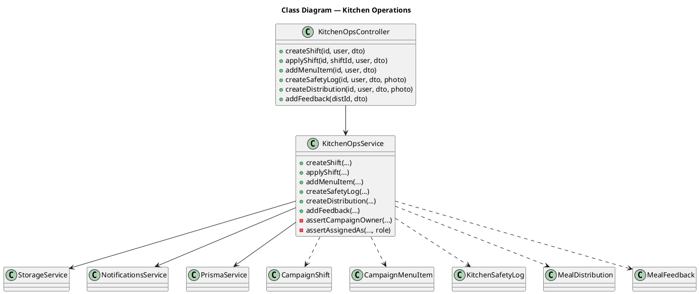

##### 3.7.2 Food Safety Log (HACCP-lite)
Sequence diagram: **`18-Kitchen-SafetyLog`**

##### 3.7.3 Meal Distribution & Feedback
Sequence diagram: **`19-Kitchen-MealDistribution`**

#### 3.8 Recipe

##### 3.8.1 Class Diagram

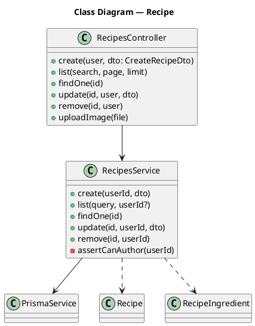

##### 3.8.2 Create Recipe
Sequence diagram: **`20-Recipe-Create`**

#### 3.9 Notifications

##### 3.9.1 Class Diagram

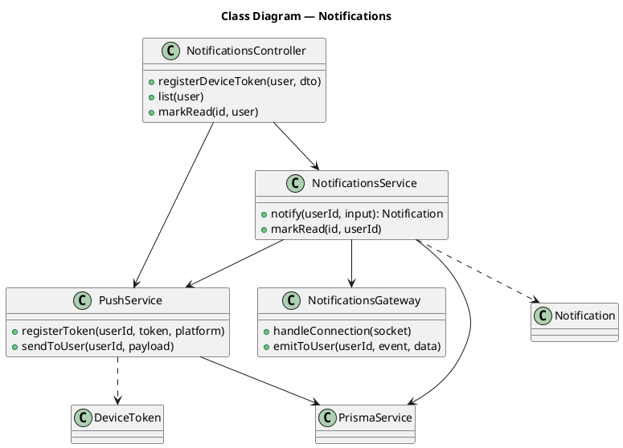

##### 3.9.2 Unified Notify (DB + WebSocket + FCM)
Sequence diagram: **`21-Notifications-Unified`**

##### 3.9.3 WebSocket Connect
Sequence diagram: **`22-WebSocket-Connect`**

#### 3.10 Background Jobs

##### 3.10.1 Cron: Expire No-shows
Sequence diagram: **`23-Cron-ExpireNoShows`**

---

> **Note for the report author:** Render each PlantUML block to PNG/SVG and insert it into the matching section in Google Docs. The sequence diagrams come from [`sequence-diagrams.puml`](sequence-diagrams.puml), referenced by the diagram names listed above. Update the Record of Changes table (section I) with your team members' names and dates.
