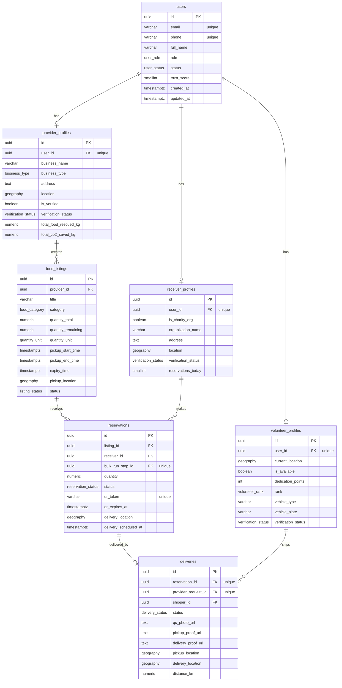
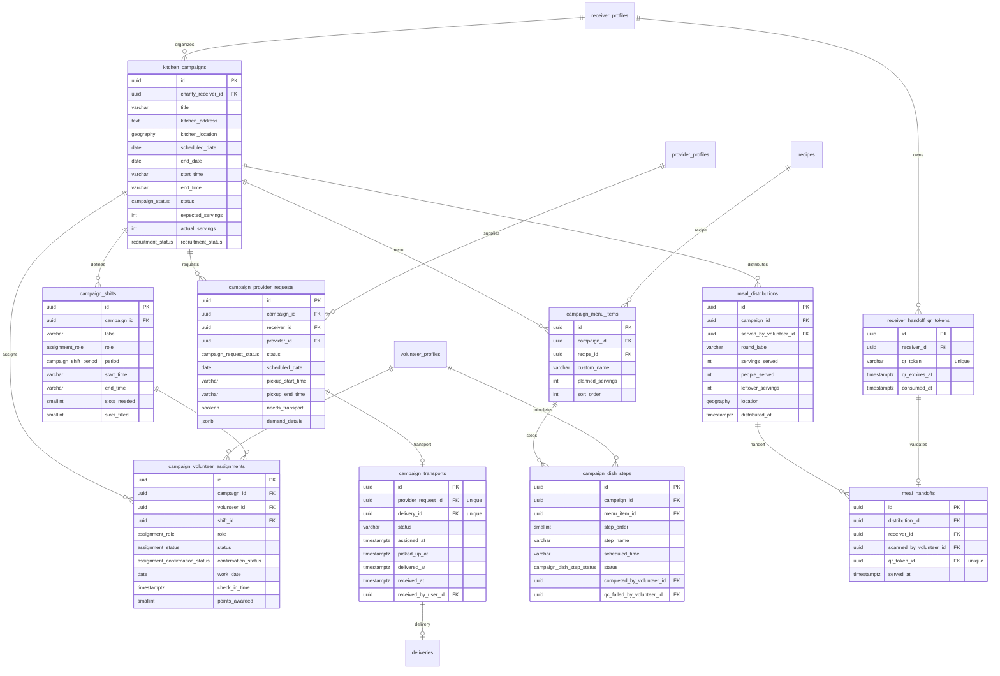

# 2. Database Design

Source of truth: [`apps/api/prisma/schema.prisma`](../apps/api/prisma/schema.prisma) and the full DBML export in [`docs/foodresq.dbml`](./foodresq.dbml).

To render a diagram like the reference image, open [`docs/foodresq.drawio`](./foodresq.drawio) in <https://app.diagrams.net/>. The database uses PostgreSQL with PostGIS geography columns for provider, receiver, listing, delivery, and campaign locations.

> Important: dbdiagram.io only accepts DBML syntax. Do not paste the Mermaid blocks below into dbdiagram.io. Mermaid is for Markdown preview only.

For draw.io/diagrams.net, use [`docs/foodresq.drawio`](./foodresq.drawio). To regenerate it after schema changes, run:

```bash
node scripts/generate-drawio-erd.cjs
```

## High-Level ERD

```mermaid
erDiagram
  users ||--o| provider_profiles : "provider account"
  users ||--o| receiver_profiles : "receiver account"
  users ||--o| volunteer_profiles : "volunteer account"
  users ||--o{ refresh_tokens : "auth sessions"
  users ||--o{ notifications : "receives"
  users ||--o{ verification_requests : "submits"
  users ||--o{ ratings : "rates"
  users ||--o{ trust_score_history : "score changes"
  users ||--o{ reports : "reports/resolves"

  provider_profiles ||--o{ food_listings : "publishes"
  food_listings ||--o{ reservations : "reserved by"
  receiver_profiles ||--o{ reservations : "creates"
  reservations ||--o{ reservation_messages : "chat"
  reservations ||--o| deliveries : "optional delivery"
  volunteer_profiles ||--o{ deliveries : "ships"
  deliveries ||--o{ shipper_task_offers : "offered to shippers"
  volunteer_profiles ||--o{ shipper_task_offers : "receives offers"

  food_listings ||--o{ bulk_runs : "bulk rescue"
  provider_profiles ||--o{ bulk_runs : "approves"
  volunteer_profiles ||--o{ bulk_runs : "delivers"
  bulk_runs ||--o{ bulk_run_stops : "distribution stops"
  bulk_run_stops ||--o| reservations : "linked reservation"

  receiver_profiles ||--o{ kitchen_campaigns : "charity organizer"
  kitchen_campaigns ||--o{ campaign_shifts : "needs shifts"
  kitchen_campaigns ||--o{ campaign_volunteer_assignments : "assigns"
  volunteer_profiles ||--o{ campaign_volunteer_assignments : "joins"
  campaign_shifts ||--o{ campaign_volunteer_assignments : "fills"
  kitchen_campaigns ||--o{ campaign_provider_requests : "requests supply"
  provider_profiles ||--o{ campaign_provider_requests : "receives request"
  campaign_provider_requests ||--o| campaign_transports : "transport flow"
  campaign_provider_requests ||--o| deliveries : "shipper delivery"
  deliveries ||--o| campaign_transports : "delivery record"
  kitchen_campaigns ||--o{ campaign_donations : "tracks donations"
  provider_profiles ||--o{ campaign_donations : "donates"
  campaign_provider_requests ||--o{ campaign_donations : "creates donation"
  campaign_provider_requests ||--o| campaign_ingredient_pickups : "self pickup"

  users ||--o{ recipes : "authors"
  recipes ||--o{ recipe_ingredients : "contains"
  kitchen_campaigns ||--o{ campaign_menu_items : "menu"
  recipes ||--o{ campaign_menu_items : "used in"
  campaign_menu_items ||--o{ campaign_dish_steps : "workflow"
  kitchen_campaigns ||--o{ campaign_dish_steps : "daily steps"
  volunteer_profiles ||--o{ campaign_dish_steps : "completes/qc"

  kitchen_campaigns ||--o{ meal_distributions : "distribution rounds"
  volunteer_profiles ||--o{ meal_distributions : "serves"
  meal_distributions ||--o{ meal_feedback : "feedback"
  receiver_profiles ||--o{ receiver_handoff_qr_tokens : "handoff QR"
  meal_distributions ||--o{ meal_handoffs : "handoffs"
  receiver_profiles ||--o{ meal_handoffs : "receives meals"
  volunteer_profiles ||--o{ meal_handoffs : "scans"
  receiver_handoff_qr_tokens ||--o| meal_handoffs : "consumed by"
  meal_handoffs ||--o| beneficiary_feedback : "beneficiary feedback"

  food_catalog_categories ||--o{ food_catalog_items : "groups"
  provider_profiles ||--o{ esg_snapshots : "impact snapshots"
```



## Core Tables



## Campaign And Kitchen Operations



## Support Tables

```mermaid
erDiagram
  refresh_tokens {
    uuid id PK
    uuid user_id FK
    text token_hash "unique"
    boolean is_revoked
    timestamptz expires_at
  }

  verification_requests {
    uuid id PK
    uuid user_id FK
    verification_request_type request_type
    jsonb documents
    verification_status status
    uuid reviewer_id FK
  }

  ratings {
    uuid id PK
    varchar reference_type
    uuid reference_id
    uuid rater_id FK
    uuid ratee_id FK
    smallint score
  }

  trust_score_history {
    uuid id PK
    uuid user_id FK
    smallint delta
    trust_score_reason reason
    smallint score_before
    smallint score_after
  }

  dedication_points_history {
    uuid id PK
    uuid volunteer_id FK
    int delta
    varchar reason
    int points_before
    int points_after
  }

  reports {
    uuid id PK
    uuid reporter_id FK
    report_target_type target_type
    uuid target_id
    report_reason reason
    report_status status
    uuid resolver_id FK
  }

  notifications {
    uuid id PK
    uuid user_id FK
    varchar type
    varchar title
    jsonb data
    boolean is_read
  }

  audit_logs {
    bigint id PK
    uuid actor_id FK
    varchar action
    varchar target_type
    uuid target_id
    jsonb payload
  }

  food_catalog_categories {
    uuid id PK
    varchar name
    varchar group
    boolean is_active
  }

  food_catalog_items {
    uuid id PK
    uuid category_id FK
    varchar name
    boolean is_active
  }

  users ||--o{ refresh_tokens : owns
  users ||--o{ verification_requests : submits
  users ||--o{ ratings : rater
  users ||--o{ ratings : ratee
  users ||--o{ trust_score_history : changed
  volunteer_profiles ||--o{ dedication_points_history : earns
  users ||--o{ reports : reports
  users ||--o{ notifications : receives
  users ||--o{ audit_logs : actor
  food_catalog_categories ||--o{ food_catalog_items : contains
```



## Full DBML Rendering

For a diagram closest to the supplied screenshot:

1. Open <https://app.diagrams.net/>.
2. Choose **File → Open From → Device**.
3. Select [`docs/foodresq.drawio`](./foodresq.drawio).
4. Export as PNG/SVG/PDF for the report slide.

The source DBML is still available at [`docs/foodresq.dbml`](./foodresq.dbml). It contains all tables, column types, primary keys, unique constraints, indexes, enum references, and foreign-key relationships.
