# FoodResQ - Current System Flows For Slides

Copy one Mermaid block at a time into draw.io:

Arrange -> Insert -> Advanced -> Mermaid -> paste -> Insert.

## Flow 0 - Registration & Account Management

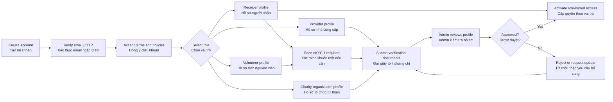

## Flow 1 - Provider Food Listing & Reservation

```mermaid
flowchart LR
  A["Provider creates food listing<br/>Provider tạo tin thực phẩm"]
  B["Add title, image, quantity, pickup time, expiry, location<br/>Nhập món, ảnh, số lượng, giờ nhận, hạn dùng, vị trí"]
  C["System stores pickup location with PostGIS<br/>Lưu vị trí bằng PostGIS"]
  D["Provider publishes listing<br/>Provider đăng tin"]
  E["Listing status = active<br/>Tin chuyển sang active"]
  F["Receiver searches nearby food<br/>Người nhận tìm món gần mình"]
  G["System filters by radius, expiry, quantity<br/>Lọc theo bán kính, hạn dùng, số lượng"]
  H["Receiver selects listing and quantity<br/>Chọn món và số lượng"]
  I["System checks daily limit and trust score<br/>Kiểm tra giới hạn ngày và điểm uy tín"]
  J["Redis locks listing quantity<br/>Redis khóa số lượng"]
  K["Transaction creates reservation and decreases remaining quantity<br/>Transaction tạo đơn và trừ tồn"]
  L["Generate QR token<br/>Sinh mã QR"]
  M["Provider sees pickup order<br/>Provider thấy đơn nhận hàng"]

  A --> B --> C --> D --> E --> F --> G --> H --> I --> J --> K --> L --> M
```

## Flow 2 - Receiver Self Pickup With QR

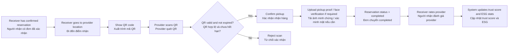

## Flow 3 - Volunteer Delivery Assignment

```mermaid
flowchart LR
  A["Receiver reserves food with delivery<br/>Người nhận đặt món có giao hàng"]
  B["System creates delivery = pending_assignment<br/>Tạo delivery chờ shipper"]
  C["Find nearby available shippers by PostGIS<br/>Tìm shipper gần nhất bằng PostGIS"]
  D["Broadcast task offers<br/>Gửi lời mời nhận đơn"]
  E{"Shipper accepts before offer expires?<br/>Shipper nhận trước khi hết hạn?"}
  F["Assign first accepted shipper<br/>Gán shipper đầu tiên nhận"]
  G["Expire remaining offers<br/>Hết hạn các offer còn lại"]
  H["Shipper goes to provider<br/>Shipper đến provider"]
  I["Confirm pickup / upload proof<br/>Xác nhận lấy hàng / ảnh minh chứng"]
  J["Deliver to receiver<br/>Giao cho người nhận"]
  K["Receiver confirms delivery<br/>Người nhận xác nhận"]
  L["Delivery status = delivered<br/>Đơn giao chuyển delivered"]
  M["Rate and award dedication points<br/>Đánh giá và cộng điểm cống hiến"]
  X["Re-broadcast or mark failed<br/>Gửi lại offer hoặc đánh dấu thất bại"]

  A --> B --> C --> D --> E
  E -->|Yes| F --> G --> H --> I --> J --> K --> L --> M
  E -->|No| X --> C
```

## Flow 4 - Bulk Run / Multi-stop Distribution

```mermaid
flowchart LR
  A["Create bulk run request<br/>Tạo yêu cầu phân phối số lượng lớn"]
  B["Define pickup source and multiple stops<br/>Khai báo điểm lấy và nhiều điểm phát"]
  C["Volunteer shipper accepts bulk run<br/>Shipper nhận chuyến bulk"]
  D["Go to pickup source<br/>Đến điểm lấy hàng"]
  E["Confirm pickup quantity<br/>Xác nhận số lượng lấy"]
  F["Navigate to stop 1..n<br/>Di chuyển qua các điểm phát"]
  G["Record served quantity, photo, note<br/>Ghi số suất, ảnh, ghi chú"]
  H{"More stops?<br/>Còn điểm phát?"}
  I["Record leftover servings<br/>Ghi nhận suất còn dư"]
  J["Complete bulk run<br/>Hoàn tất chuyến bulk"]
  K["Update history and volunteer points<br/>Cập nhật lịch sử và điểm TNV"]

  A --> B --> C --> D --> E --> F --> G --> H
  H -->|Yes| F
  H -->|No| I --> J --> K
```

## Flow 5 - Charity Kitchen Campaign

```mermaid
flowchart LR
  A["Charity creates campaign<br/>Tổ chức tạo chiến dịch"]
  B["System validates charity profile<br/>Hệ thống kiểm tra hồ sơ"]
  C["Admin reviews campaign<br/>Admin duyệt chiến dịch"]
  D{"Approved?<br/>Được duyệt?"}
  E["Campaign status = open<br/>Chiến dịch được mở"]
  F["Volunteers apply for chef / waiter / shipper<br/>TNV ứng tuyển vai trò"]
  G["Charity/Admin assigns volunteers<br/>Phân công tình nguyện viên"]
  H["Providers pledge donations<br/>Provider cam kết quyên góp"]
  I["Charity confirms received donations<br/>Tổ chức xác nhận đã nhận"]
  J["Campaign starts<br/>Chiến dịch bắt đầu"]
  K["Volunteers check in<br/>TNV check-in"]
  L["Chefs prepare meals<br/>Đầu bếp chuẩn bị món"]
  M{"Food safety check<br/>Kiểm tra ATTP"}
  N["Distribute meals<br/>Phân phát suất ăn"]
  O["Record meal distribution<br/>Ghi nhận số suất, ảnh, vị trí"]
  P["Collect beneficiary feedback<br/>Nhận phản hồi người thụ hưởng"]
  Q["Complete campaign<br/>Hoàn tất chiến dịch"]
  R["Update impact and dedication points<br/>Cập nhật tác động và điểm TNV"]
  X["Reject / request changes<br/>Từ chối hoặc yêu cầu sửa"]
  Y["Notify charity and handle issue<br/>Cảnh báo tổ chức và xử lý"]

  A --> B --> C --> D
  D -->|No| X --> A
  D -->|Yes| E
  E --> F --> G
  E --> H --> I
  G --> J
  I --> J
  J --> K --> L --> M
  M -->|Pass| N --> O --> P --> Q --> R
  M -->|Warning / Fail| Y --> M
```

## Flow 6 - Provider Donation To Campaign

```mermaid
flowchart LR
  A["Provider opens campaign list<br/>Provider mở danh sách chiến dịch"]
  B["Select open / in-progress campaign<br/>Chọn chiến dịch đang mở"]
  C["Pledge ingredients<br/>Cam kết nguyên liệu"]
  D["System creates donation = pledged<br/>Tạo donation trạng thái pledged"]
  E["Notify charity<br/>Thông báo tổ chức"]
  F["Charity receives ingredients<br/>Tổ chức nhận nguyên liệu"]
  G["Charity confirms donation<br/>Tổ chức xác nhận donation"]
  H["Donation status = received<br/>Donation chuyển received"]
  I["Notify provider<br/>Thông báo provider"]

  A --> B --> C --> D --> E --> F --> G --> H --> I
```

## Flow 7 - Kitchen Operation: Safety Log, Distribution, Feedback

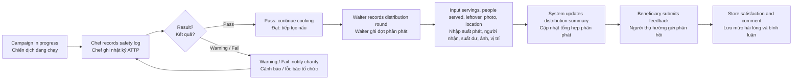

## Flow 8 - Campaign Volunteer Task Progress

```mermaid
flowchart LR
  A["Volunteer assigned to campaign<br/>TNV được phân công"]
  B["Open my task<br/>Mở nhiệm vụ của tôi"]
  C["Check in with proof photo<br/>Check-in kèm ảnh minh chứng"]
  D["Status = checked_in<br/>Trạng thái checked_in"]
  E["Start task<br/>Bắt đầu nhiệm vụ"]
  F["Status = in_progress<br/>Trạng thái in_progress"]
  G["Complete task with proof photo<br/>Hoàn thành kèm ảnh minh chứng"]
  H["Status = completed<br/>Trạng thái completed"]
  I["Award dedication points<br/>Cộng điểm cống hiến"]
  J["Save points history<br/>Lưu lịch sử điểm"]

  A --> B --> C --> D --> E --> F --> G --> H --> I --> J
```

## Flow 9 - Trust Score, Report & Account Enforcement

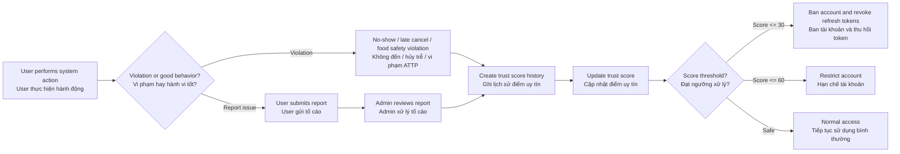

## Flow 10 - Admin Governance

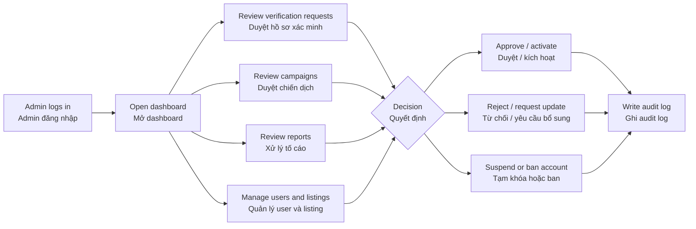

## Flow 11 - Notification & Realtime Update

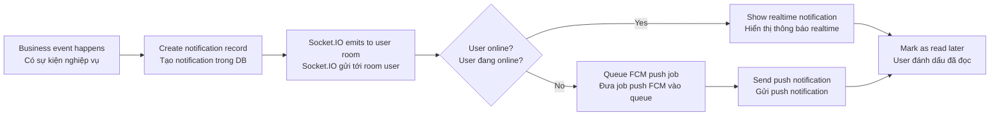

## Flow 12 - Recipe & Campaign Menu

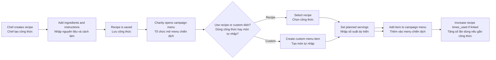

## Flow 13 - ESG / Impact Reporting

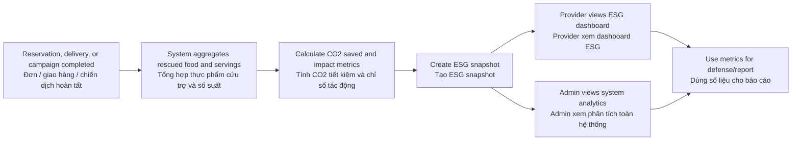
